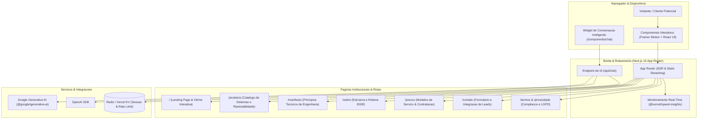
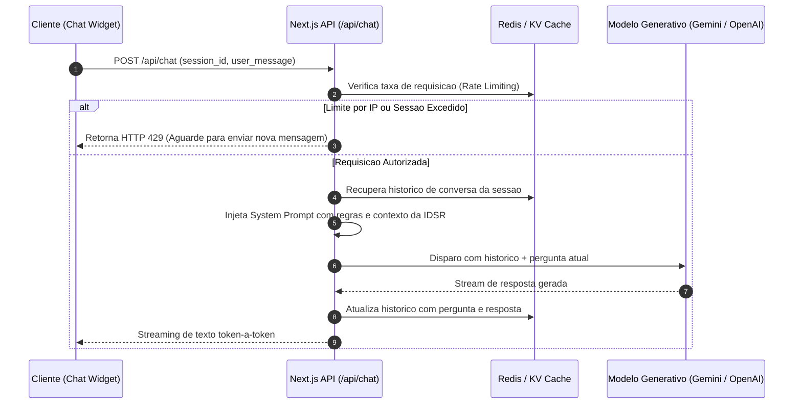

# IDSR — Plataforma Web Corporativa, Portfolio Interativo e Canal de Vendas

Plataforma web institucional e portfólio interativo de alta conversão da IDSR (Infraestrutura de Dados, Sistemas e Rastreabilidade). O sistema integra apresentação de cases de engenharia, catálogo de soluções, manifesto técnico e assistente inteligente de vendas conectado a modelos de linguagem e cache de estado distribuído.

---

## 1. Visao Geral & Proposito do Sistema

O IDSR atua como o ponto central de presença digital e captação de clientes da empresa, combinando:
- **Portfólio Interativo de Soluções**: Demonstração de produtos e arquiteturas desenvolvidas (rastreabilidade, microsserviços, automações fiscais e integrações corporativas).
- **Canal de Atendimento e Conversão com IA**: Mecanismo de triagem automática e suporte em tempo real (`/api/chat`) alimentado por Google Gemini e OpenAI com persistência de contexto em Redis.
- **Manifesto de Engenharia & Transparência**: Posicionamento claro sobre princípios de Extreme Programming (XP), software sob medida, dados limpos e ausência de intermediários desnecessários.
- **Estrutura Completa de Conformidade**: Páginas dedicadas para Termos de Uso, Política de Privacidade e alinhamento com a LGPD.

---

## 2. Arquitetura da Aplicacao

Construída sobre o ecossistema Next.js 16 (App Router) e React 19, a aplicação utiliza renderização híbrida (Server-Side Rendering para SEO de alto impacto e Client Islands com Framer Motion para fluidez de interface).



---

## 3. Fluxo de Atendimento com IA (/api/chat)

O assistente virtual de triagem e vendas opera em pipeline estruturado para guiar o visitante pelo portfólio e qualificar leads:



---

## 4. Estrutura de Rotas e Modulos

| Rota | Objetivo | Estrategia de Renderizacao |
|---|---|:---:|
| `/` | Landing page principal com destaque de cases, proposta de valor e CTA | SSR + ISR |
| `/produtos` | Catalogo de sistemas proprietarios, modulos TEF, rastreabilidade e integracoes | Static com Revalidacao |
| `/manifesto` | Declaracao de engenharia, compromisso com software confiavel e zero intermediarios | Static Puro |
| `/sobre` | Visao institucional, stack de tecnologia e lideranca tecnica da IDSR | Static Puro |
| `/precos` | Estrutura de precos, planos corporativos e condicoes de desenvolvimento | Static com Dynamic Pricing |
| `/contato` | Canal direto para contratacao, envio de briefing e integracao com CRM | Client Form + API |
| `/suporte` | Central de ajuda, SLAs e canais de atendimento pos-entrega | Static |
| `/privacidade` | Politica de privacidade em conformidade estrita com a LGPD | Static |
| `/termos` | Termos de uso dos servicos e plataformas IDSR | Static |
| `/api/chat` | Endpoint backend para orquestracao de dialogo com IA e cache de sessao | Edge Route (POST) |

---

## 5. Stack Tecnologica e Dependencias

| Camada | Tecnologia | Versao | Justificativa |
|---|---|:---:|---|
| **Framework** | Next.js (App Router) | 16.1.0 | Roteamento nativo na borda, streaming SSR e Server Actions |
| **Biblioteca de UI** | React | 19.2.3 | Concorrencia nativa, Server Components e compilador React |
| **Linguagem** | TypeScript | 5.x | Tipagem estrita ponta a ponta e seguranca de refatoracao |
| **Estilizacao** | Tailwind CSS | 4.x | Utilitarios sem runtime JS e compilacao de CSS de alta performance |
| **Animacoes** | Framer Motion | 12.23 | Micro-interacoes fluidas, transicoes de layout e animacoes declarativas |
| **Iconografia** | Lucide React | 0.562 | Conjunto consistente de icones vetoriais SVG ultra-leves |
| **Persistencia KV** | Redis / @vercel/kv | 5.10 / 3.0 | Cache em memoria ultrarrapido para sessoes e limitador de taxa |
| **Modelos de IA** | Google GenAI / OpenAI | 0.24 / 6.16 | Orquestracao flexivel de LLMs para atendimento comercial |
| **Métricas** | @vercel/speed-insights | 1.3 | Telemetria e analise de Core Web Vitals reais em producao |

---

## 6. Configuracao de Ambiente e Execucao Local

### Pre-requisitos
- Node.js v20 ou superior (recomendado v24 LTS)
- Gerenciador de pacotes npm, yarn, pnpm ou bun
- Instancia Redis local ou credenciais Vercel KV

### Variaveis de Ambiente
Crie o arquivo `.env.local` na raiz do projeto:

```bash
cp .env.example .env.local
```

| Variavel | Descricao | Obrigatoria |
|---|---|:---:|
| `KV_REST_API_URL` | Endpoint HTTP da instancia Redis / Vercel KV | Sim (para o chat) |
| `KV_REST_API_TOKEN` | Token de autenticacao do Redis KV | Sim (para o chat) |
| `GEMINI_API_KEY` | Chave de acesso a Google AI Studio | Opcional (se usar Gemini) |
| `OPENAI_API_KEY` | Chave de acesso a OpenAI API | Opcional (se usar GPT) |
| `NEXT_PUBLIC_SITE_URL` | URL base do dominio em producao (ex: `https://idsr.com.br`) | Sim (para SEO) |

Veja a lista completa e atualizada de variáveis em [`.env.example`](.env.example) — cada uma comentada com sua finalidade.

### Execucao em Desenvolvimento
```bash
# 1. Instalar dependencias
npm install

# 2. Executar servidor local
npm run dev
```

Acesse a aplicacao em: `http://localhost:3000`.

### Build e Verificacao de Producao
```bash
# Checagem estatica de tipos e linter
npm run lint

# Compilacao do bundle otimizado
npm run build

# Execucao do servidor de producao
npm run start
```

---

## 7. Praticas de Engenharia, SEO e Acessibilidade

- **Metadados Dinamicos**: Cada pagina implementa a Metadata API do Next.js gerando OpenGraph tags, canonical URLs e Twitter Cards completos.
- **Otimizacao de Tipografia**: Carregamento de fontes variaveis atraves de `next/font`, eliminando CLS (Cumulative Layout Shift) e requisicoes externas de terceiros em tempo de execucao.
- **Acessibilidade e Semantica**: Estruturacao semantica com landmarks HTML5 (`header`, `main`, `section`, `footer`), contraste de cores conforme WCAG AA e atributos ARIA no widget de conversacao.
- **Auditoria de Codigo**: Configuracao estrita do ESLint 9 com regras de compatibilidade do compilador React 19.

---

## 8. Deploy em Producao

A aplicacao esta homologada para deploy continuo na Vercel ou em servidor proprio:

### Deploy na Vercel
1. Conecte o repositorio `blablabl4/IDSR-SitePortifolio`.
2. Configure as variaveis de ambiente no painel de Settings (`KV_REST_API_URL`, `GEMINI_API_KEY`, etc.).
3. O build sera executado automaticamente a cada push na branch principal.

### Deploy Standalone (Docker / VPS)
O projeto pode ser empacotado como container Docker utilizando a saida standalone do Next.js:
```dockerfile
# O next.config.js ja esta preparado com output: 'standalone'
FROM node:24-alpine AS runner
WORKDIR /app
COPY .next/standalone ./
COPY .next/static ./.next/static
COPY public ./public
EXPOSE 3000
CMD ["node", "server.js"]
```

---

## 9. Licenca

Propriedade intelectual da IDSR — Infraestrutura de Dados, Sistemas e Rastreabilidade. Todos os direitos reservados.
